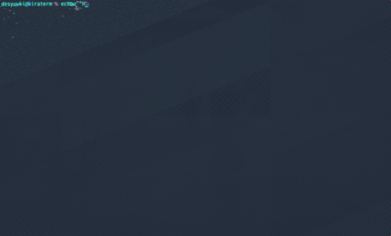

# kiraterm

CRT / グリッチ風エフェクト付きの GPU レンダリング (wgpu) ターミナルエミュレータ。
入力 / 出力に反応してパーティクル・グリッチが走ります。

## Demo

<video src="https://github.com/yuwki0131/kiraterm/raw/main/assets/demo.mp4" controls muted loop playsinline width="720"></video>

<!-- fallback (mp4 が再生できない場合) -->



> `assets/demo.mp4` (960px, ~10s) と `assets/demo.gif` (480px, ~8s) を同梱しています。

## 特徴

- **GPU レンダリング** — wgpu (Vulkan / Metal / DX12) で文字とエフェクトを合成
- **CRT 風ポストプロセス** — バレル歪み・ビネット・スキャンライン・色収差・ノイズ
- **リアクティブなエフェクト** — キー入力とシェル出力の両方でパーティクル + グリッチが発生
- **日本語表示対応** — CJK フォント (HackGen Console / Noto Sans Mono CJK JP など) を自動フォールバック、ワイド文字は 2 セル占有
- **TUI 対応** — Alternate Screen Buffer, Scroll Region, カーソル save/restore, 表示制御, 行/文字の挿入・削除, SGR (bold/underline/reverse/24bit color) など主要な VT シーケンスに対応
- **シェル終了でウィンドウが閉じる** — シェルの `exit` で自動的にプロセス終了

## 動作要件

- Rust (`cargo`) 1.75+
- Wayland / X11 環境
- Vulkan または他の wgpu 対応 GPU バックエンド
- (推奨) CJK 対応の等幅フォント: `HackGen Console`, `Noto Sans Mono CJK JP` など

NixOS の場合は `shell.nix` を同梱しているため `nix-shell` で必要ライブラリが解決されます。

## ビルドと起動

### `run.sh` (推奨)

```sh
./run.sh
```

内部で `nix-shell` を優先して使い、初回はリリースビルドを行った上で `target/release/kiraterm` を起動します。Nix 環境でなければ、システムに Wayland / Vulkan / xkb が入っている前提で `cargo build --release` にフォールバックします。

### 手動

```sh
cargo build --release
./target/release/kiraterm
```

Nix でないシステムでライブラリが見つからない場合は、以下を LD_LIBRARY_PATH に追加してください:

- `libwayland-client`, `libxkbcommon`
- `libvulkan`, `libGL`
- `libfontconfig`, `libfreetype`

## キーバインド

| キー | 動作 |
|---|---|
| 通常キー | UTF-8 として PTY へ送信 |
| Ctrl+A–Z | 制御文字 (0x01–0x1A) を送信 |
| Alt+key | ESC prefix (`0x1B` を先頭に付与) |
| 矢印 / Home / End / PgUp / PgDn / Del | 対応する xterm シーケンスを送信 |

シェルは環境変数 `$SHELL` を使用します。未設定なら `/bin/bash`。

## エフェクト

- **入力時**: シアン系のパーティクル + 大きめのグリッチ (0.6 加算)
- **出力時**: マゼンタ系のパーティクル + 出力バイト量に比例したグリッチ (0.15–0.45 加算)
- **アイドル時**: グリッチは秒あたり 2.0 で減衰

シェーダは `src/shaders/` にあります。

- `text.wgsl` — テキスト / 背景セル
- `particles.wgsl` — パーティクル (加算合成)
- `post.wgsl` — CRT ポストプロセス (歪み・スキャンライン・ノイズ・色収差)

## デモ動画の再生成

`assets/` の動画は開発中に `grim` (Wayland キャプチャ) + `ffmpeg` で生成しています。同等の再生成をしたい場合の参考:

```sh
setsid nix-shell shell.nix --run \
  'SHELL=/path/to/demo.sh exec ./target/release/kiraterm' &
# hyprctl などで座標を拾って grim -g で連続キャプチャ
# ffmpeg -framerate 10 -i frame_%03d.png -vf 'scale=960:-2' -c:v libx264 demo.mp4
```

## 制限事項

- スクロールバック (履歴) は未実装
- マウスイベントは未対応
- IME (プリエディット) は winit のイベントのみで、変換中の表示は行いません
- `Sixel` / 画像プロトコルは未対応
- 一部の CSI/OSC (タイトル設定、DECRQM 応答等) は未実装

## ライセンス

未定 (作者に確認)。
